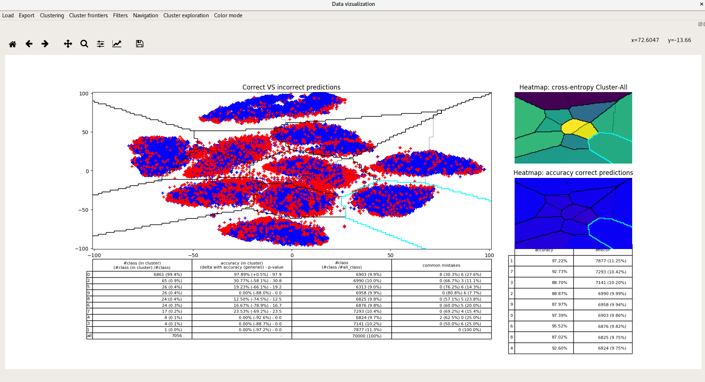

Data vizualization
==================

This is a collection of tools to represent and navigate through the high-dimensional data. The algorithm t-SNE has been used to construct the 2D space so some choices and feature of the visualization may reflect that. The module should be agnostic of the data provided.

Usage
-----
### How to install ?
```sh
pip install vizuka
```
or clone the repo

### How to run?

Simply run
```sh
vizuka

# Similar to :

python3 vizuka/launch_viz.py

```

If you have a dataset containing your non-preprocessed/human-readable data (and their "columns" aka names):
you can also draw visualisations of the data in your selected cluster (see third pic)
```sh
vizuka -s amount:logdensity -s datacontainingstrings:wordcloud
```

It assumes you already have your 2D data, if not you can ask for tSNE+PCA reduction :
```sh
vizuka --reduce
```

It will search in its \_\_package\_\_/data/ the datas but you can force your own with __--path__ argument

What will I get ?
-----------------

Working examples : draw clusters, find details about inside distribution and zoom in:


Here is the view you get when you launch it :


And if you specify a set of non-preprocessed inputs to associate with your training data you can also view them in details in a per-cluster view :


### How to use ?
Navigate inside the 2D space and look at the data, selecting it in the main window (the big one). Only this one is interactive. Data is grouped by cluster, you can select cluster individually (left click).

Main window represents all the data in 2D space. Blue are good-predicted transactions, Red are the bad ones, Green are the special class (by default the label 0).

Below are three subplots :
* a summary of the data inside the selected buckets (see navigation)
* a heatmap of the red/blue/green representation
* a heatmap of the cross-entropy of each bucket empirical distribution with empirical global empirical distribution.

Data viz navigation :
* left click selects a bucket of data
* right click reset all in-memory buckets

Other options:
* filter by predictions or by real class.
* detect mouse event : if unchecked, cluster will not be selected on click (useful for zooming)
* clusterize with an algo, Dummy is a simple grid, KMeans should be used, DBSCAN is experimental.
* export x : export the raw inputs you selected in an output.csv 
* cluster borders : draw borders between clusters based on bhattacharyya similarity measure, or just all
* force number of clusters (for kmeans essentially)
* choose a different set of predictions to display

What does it needs to be executed ?
-----------------------------------

vizuka needs the following files:
* pre-processed transactions
* predictions:
    * predictor (currently only the keras NN are supported), the algo which will eat the pre-processed transactions
            it should have been trained on data ordered the same way as the raw transactions array.**or** 
    * its predictions
* 2D-projections: (optional)
    * a t-SNE (or another dimension-reduction nD-to-2D algorithm) output representing pre-processed data in a 2D-space **or**
    * parameters for t-SNE (optional, default ones are provided)
* raw transactions (optional) which will be used to display additional human-understandable info.


File structures
---------------

Your files should be structured this way :
(samples are provided in the data folder, you still need to find the raw/processed datas as it too heavy to be put here.

* pre-processed transactions:
    * type: npz
    * internal structure:
        * entry x: pre-processed inputs
        * entry y_$(OUTPUT_NAME): pre-processed label to be predicted
        * (optional) entry $(OUTPUT_NAME)_encoder: humanToMachine labels labelling
    * name: $(INPUT_FILE_BASE_NAME)_x_y$(VERSION).npz
    * path: $(DATA_PATH)

* 2D-projections:
    * type: npz
    * internal structure:
        * x_2D: array of (float, float) datas
    * name: embedded_x_1-$(REDUCTION_SIZE_FACTOR)_$(PARAMS[0])_$(PARAMS[1]).$(PARAMS[N]).npz
    * path: $(REDUCTED_DATA_PATH)

* raw transactions:
    * type: npz
    * internal_structure:
        * originals: raw transactions
	* columns: collections of string to explicit nature of the data (human-readable)
    * name: originals$(VERSION).npz
    * path: $(DATA_PATH)
    
* predictor:
    * type: npz
    * internal_structure:
        * pred: predictions
    * pred: $(PREDICTOR)$(VERSION)
    * path: $(MODEL_PATH)

Default parameters
------------------

See config.py
