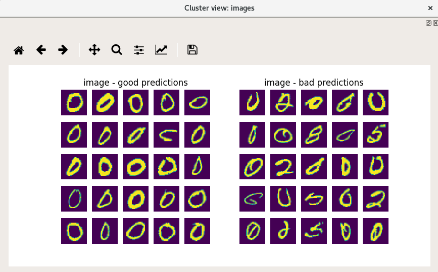

Data vizualization
==================

This is a collection of tools to represent and navigate through the high-dimensional data.
 * The algorithm t-SNE is default to construct the 2D space.
 * The module should be agnostic of the data provided.
 * It ships with MNIST for quick testing.

Usage
-----
### How to install ?
```sh
$ pip install vizuka
```
or clone the repo :)

### How to run?

```sh
$ vizuka
# For a quick working example run :
$ vizuka --mnist
# Similar to copy your data and run "vizuka --image:images --version _MNIST_example"
$ vizuka --show-required-files
# To show the format of files you need to launch a data viz 
```
You can add human-readable data visualization in data/set/raw\_data\_VERSION.npz :

```sh
$ vizuka -s price:logdensity -s name:wordcloud
# vizuka --feature-to-show raw_variable_name:{wordcloud|counter|density|logdensity|images}
```

It assumes you already have your 2D data, projection will be done if launched for the first time (not for MNIST toy example)
You can force for PCA reduction prior to t-SNE :
```sh
$ vizuka --reduce --use_pca 0.99
# Use PCA to reduce dimension and keep 99% of explained variance, then tSNE
```

It will search in \_\_package\_\_/data/ the datas but you can force your own with __--path__ argument

* Note that if you are effectively doing big data you should **uncomment MulticoreTSNE** in vizuka/dimension\_reduction/tSNE.py unless you want to discover t-SNE crashed with a segfault. Instructions for installation can be found in requirements/requirements.apt

I want to add a specific tool to this visualization ? // how to contribute ?
----------------
Add your plugins in vizuka/plugins/ 
You can define your own heatmaps, clustering engines, cluster viewer (cf 2nd image), read plugins/heatmap/How\_to\_add\_heatmap.py for documentation.

Using the plugins/ directory it will not interfere with the original code ! If it works do not hesitate to make a PR

What will I get ?
-----------------

A nice tool to draw clusters, find details about inside distribution and zoom in.
Example with MNIST toy dataset (vizuka --mnist): (**for real life example please scroll down**)





### How to use ?
Navigate inside the 2D space and look at the data, selecting it in the main window (the big one). Data is grouped by cluster, you can select cluster individually (left click).

Main window represents all the data in 2D space. Blue are good-predicted transactions, Red are the bad ones, Green are the special class (by default the label 0).

Below are three subplots :
* a summary of the data inside the selected buckets (see navigation)
* a heatmap of the red/blue/green representation
* a heatmap of the cross-entropy of each bucket empirical distribution with empirical global empirical distribution.

Data viz navigation :
* left click selects a bucket of data
* right click reset all in-memory buckets

Other options:
* filter by predictions or by real class.
* detect mouse event : if unchecked, cluster will not be selected on click (useful for zooming)
* clusterize with an algo, Dummy is a simple grid, KMeans should be used, DBSCAN is experimental.
* export x : export the raw inputs you selected in an output.csv 
* cluster borders : draw borders between clusters based on bhattacharyya similarity measure, or just all
* force number of clusters (for kmeans essentially)
* choose a different set of predictions to display

What does it needs to be executed ?
-----------------------------------

```sh
$ vizuka --show-required-files

VERSION: string that identifies your dataset (default is vizuka --version MNIST_example)
Vizuka needs the following files :

	 + data/set/preprocessed_inputs_VERSION.npz
	 ------------------------------------------
		 x:	 preprocessed inputs
		 y:	 outputs to be predicted
		 NB:	 this is the only mandatory file, the following is highly recommended:


	 + data/models/predict_VERSION.npz -> optional but recommended
	 -------------------------------------------------------------
		 pred:	 predictions returned by your algorithm
		 NB:	 should be same formatting as in preprocessed_inputs_VERSION["y"])


	 + raw_data.npz -> optional
	 --------------------------
		 x:		 array of inputs BEFORE preprocessing
					 probably human-readbable, thus useful for vizualization
		 columns:	 the name of the columns variable in x
		 NB:	 this file is used if you run vizuka with
			    --feature-name-to-display COLUMN_NAME:PLOTTER COLUMN_NAME2:PLOTTER2 or
			    --feature-name-to-filter COLUMN_NAME1 COLUMN_NAME2 (see help for details)


	 + reduced/2Dembedding_PARAMS_VERSION.npz -> reaaaally optional
	 --------------------------------------------------------------
		 x2D:	 projections of the preprocessed inputs x in a 2D space
		 NB:	 this set is automatically generated with tSNE but you can specify your own

```

Typical use-case :
------------------

You have your preprocessed data ? Cool, this is the only mandatory file you need. Place it in the folder *data/set/preprocessed_inputs_VERSION.npz*, VERSION being a string specific to this specific dataset. It must contains at least the key 'x' representing the vectors you learn from. If you have both the correct output and your own predicitons (inside *data/models/ALGONAMEpredict_VERSION.npz* and key 'pred' *predict_VERSION.npz* will be the default loaded) that your algo try to predict, place it under the key 'y', the data viz will be much more useful !

Optionally you can add an *raw_data_VERSION.npz* file containing raw data non-preprocessed. The vector should be the key "originals" and the name of the human-readable "features" in the key "columns".

Now you may want to launch Vizuka ! First do specify the parameters fitting your needs in config.py. And take some coffee. Or two. Or three. Vizuka is busy reducing the dimension.

...

Congratulations ! Now you may want to display your 2D-data, as your arble to browse your embedded space. Maybe you want to look for a specific cluster. Explore the data with graph options, zoom in and zoom out, and use the filters provided to find an interesting area.

When you are satisfied, enable "detect mouse event" to be able to select clusters. This is quite unefficient you will select smal rectangular tiles one by one, you may want to *Clusterize* using KMeans or DBSCAN.

Great now you can select whole clusters of data at once. But what's in there ? Click on the *export* button to find out in a nicely formatted csv (assuming you provided "raw" data).

You finished your session but still want to dive in the clusters later ? Just select *Save clusterization* to save your session.


Default parameters
------------------

See config.py

Real life example
=================


