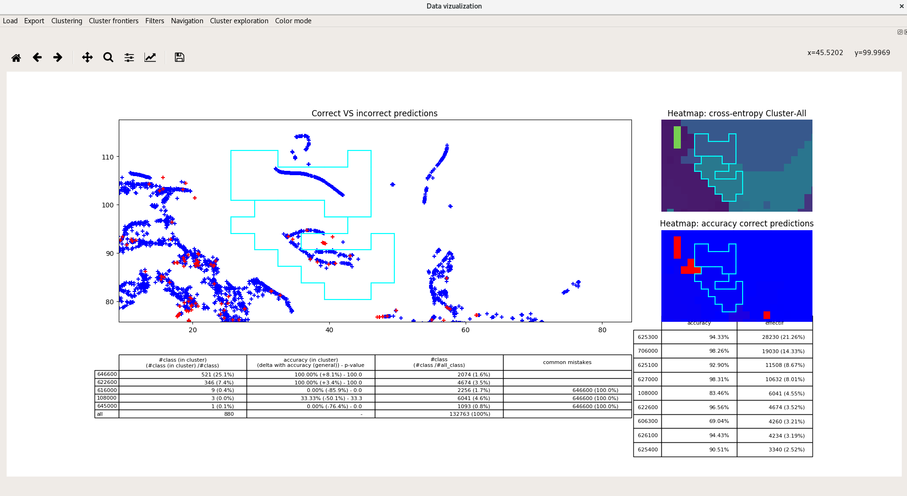

Data visualization
==================

This is a collection of tools to represent and navigate through high-dimensional datasets.
 * The algorithm t-SNE is set as default to construct the 2D space.
 * The module should be agnostic of the data provided.
 * It ships with MNIST for quick testing.


Usage
-----
### How to install ?
```sh
$ pip install vizuka
```
or clone the repo :)

build-essential is required for the wordcloud
```sh
# apt-get install build-essential
```


### How to run?


```sh
$ vizuka # launch the visualization tool

# For a quick working example with MNIST run :
$ vizuka --mnist
# Similar to downloading MNIST, fit a basic logistic and project in 2D with tSNE

$ vizuka --show-required-files
# To show the format of files you need to launch a data viz
```

But you don't want to use MNIST toy-dataset right ? Here is a complete working example:
```sh
# EXAMPLE :
# you have your preprocessed data in 		~/data/set/preprocessed_MYDATASET01.npz
#                 and predictions in 		~/data/set/predict_MYDATASET01.npz
#		  optionnaly the raw dataset in ~/data/set/raw_data_MYDATASET01.npz
# Run :
$ vizuka-reduce --path ~/data --version MYDATASET01 # projects in 2D
$ vizuka 	--path ~/data --version MYDATASET01
```


It will search in \_\_package\_\_/data/ the datas but you can force your own with __--path__ argument

* Note that if you are effectively doing big data you should install **MulticoreTSNE** in vizuka/dimension\_reduction/tSNE.py unless you want to discover t-SNE crashed with a segfault. Instructions for installation can be found in requirements/requirements.apt

Plugin structure
----------------
Add your plugins in vizuka/plugins/

You can define your own:
 * dimension reduction algorithm
 * heatmaps
 * clustering engines
 * cluster delimiter (frontiers)
 * cluster viewer (cf last image)

Only thing to do : use the *vizuka/plugin/dimension\_reduction/* (for e.g) and follow the instruction from *How\_to\_add\_dimension\_reduction\_plugin.py*

Your plugin will be available in all vizuka, in IHM and cmdline without further adjustment

What will I get ?
-----------------

A nice tool to draw clusters, find details about inside distribution and zoom in.
Example with MNIST toy dataset (vizuka --mnist): (**for real life example please scroll down**)


### How to use ?
Navigate inside the 2D space and look at the data, selecting it in the main window (the big one). Data is grouped by cluster, you can select cluster individually (left click).

Main window represents all the data in 2D space. Blue are good-predicted transactions, Red are the bad ones, Green are the special class (by default the label 0).

Below are three subplots :
* a summary of the data inside the selected buckets (see navigation)
* a heatmap of the red/blue/green representation
* a heatmap of the cross-entropy of each bucket empirical distribution with empirical global empirical distribution.

Data viz navigation :
* left click selects a bucket of data
* right click reset all in-memory buckets

Other options:
* clusterize with an algo, a simple grid, or kMeans, DBSCAN...
* visualize the distribution of classes inside selected clusters
* visualize the distribution of features inside selected clusters
* filter by predicted class or by real class.
* filter by any feature you may have in your raw (non-preprocessed) dataset
* export x : export the data you selected in an output.csv 
* cluster borders : draw borders between clusters based on bhattacharyya similarity measure, or just all
* choose a different set of predictions to display

What does it needs to be executed ?
-----------------------------------

```sh
$ vizuka --show-required-files

VERSION: string that identifies your dataset (default is MNIST_example)
PATH	: data/ is located in /home/sofian/data_viz/manakin-ml-analytics/vizuka, change with --path
FORMAT	: all are .npz file

REQUIRED:
=========
	 + data/set/preprocessed_inputs_VERSION.npz
	 ------------------------------------------
		 x:	 preprocessed inputs, your feature space
		 y:	 outputs to be predicted, the "true" class
		 NB:	 this is the only mandatory file, the following is highly recommended:


OPTIONAL BUT USEFUL:
===================
	 + data/models/predict_VERSION.npz -> optional but recommended
	 -------------------------------------------------------------
		 y:	 predictions returned by your algorithm
		 NB:	 should be same formatting as in preprocessed_inputs_VERSION["y"])
				 if you don't have one, use --force-no-predict


	 + data/set/raw_data_VERSION.npz -> optional
	 --------------------------
		 x:		 array of inputs BEFORE preprocessing
					 probably human-readable, thus useful for visualization
		 columns:	 the name of the columns variable in x
		 NB:	 this file is used if you run vizuka with
			    --feature-name-to-display COLUMN_NAME:PLOTTER COLUMN_NAME2:PLOTTER2 or
			    (see help for details)


GENERATED BY VIZUKA:
====================
	 + data/reduced/algoname#VERSION#PARAM1_NAME::VALUE#PARAM2_NAME::VALUE.npz
	 ------------------------------------------------------------------------
		 x2D:	 projections of the preprocessed inputs x in a 2D space
		 NB:	 you can change default projection parameters and works with several ones
			 see vizuka-reduce

```

Typical use-case :
------------------

You have your preprocessed data ? Cool, this is the only mandatory file you need. Place it in the folder *data/set/preprocessed_inputs\_VERSION.npz*, VERSION being a string specific to this specific dataset. It must contains at least the key 'x' representing the vectors you learn from. If you have both the correct output and your own predicitons (inside *data/models/* and prediction under npz key "y", default loaded is predict_VERSION.npz, cf --show-requiredfiles).

Optionally you can add a *raw_data_VERSION.npz* file containing raw data non-preprocessed. The vector should be the key "x" and the name of the human-readable "features" in the key "columns".

Now you may want to launch Vizuka ! First project your preprocessed space in 2D with vizuka-reduce, then visualize with vizuka.

And take some coffee.

Or two.

Or three, Vizuka is busy reducing the dimension.

...

Congratulations ! Now you may want to display your 2D-data, as your able to browse your embedded space. Maybe you want to look for a specific cluster. Explore the data with graph options, zoom in and zoom out, and use the filters provided to find an interesting area.

When you are satisfied, click to select clusters. This is quite unefficient you will select small rectangular tiles one by one on a grid, you may want to *Clusterize* using KMeans or DBSCAN.

Great now you can select whole clusters of data at once. But what's in there ? Use the menu Cluster exploration for that. When you are done click on the *export* button to find out in a nicely formatted csv (assuming you provided "raw" data) containing the data in the clusters you selected.

You finished your session but still want to dive in the clusters later ? Just select *Save clusterization* to save your session.


Default parameters
------------------

See config.py

Real life example
=================


